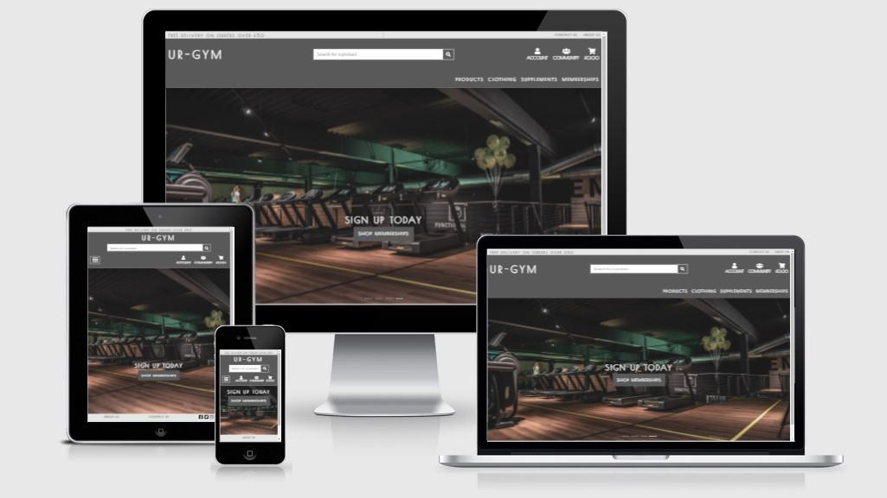

# Ifti Khan Milestone Project 4 - Fullstack Frameworks with Django

[Click Here To Visit My Deployed Project Site](https://iftikhan-ms4-project-urgym.herokuapp.com/)

## Project Title - UR-GYM

### Introduction
This repository is showcasing my fourth and final milestone project for The Code Institute.

For this project I have chosen to do an ecommerce website for a gym that I have made up called UR-GYM. This web application will allow users to purchase gym merchandise as well as gym memberships, they will also have the option to register, login, and ask for advice on a community message board. 

The reason I have chosen to do this as my fourth and final milestone project is that it will allow me to showcase the new Django skills learnt from The Code Institute and my previous skills from other projects. The key skills being showcased here are the Django framework, MySQL database and the Bootstrap framework 

# UX – User Experience
## The Who?
The project will be designed for enthusiastic gym users who want to find and purchase gym merchandise online as well as gym memberships and seeking advice from other gym users. 

## The What?
The project will be aimed users who want to find and purchase a gym membership ranging from one month to twelve months. It will also allow them to find and purchase gym merchandise which will include clothing items, supplements, vitamins and protein powders. 

Once they have found what they are looking for, the user can then purchase items by filling in the relevant information and make a purchase. The Project will also allow users to connect with other gym users by allowing them to create posts on a message board asking other users for advice on certain subject, which will create an online social community. 

## The How?
I will be using a variety of different technologies and techniques to create this project, the first is the Django framework, along with the Bootstrap framework and a MySQL database to store product information. 

The web application will allow all users to find and make a purchase, but registered user will have the ability to view order history and store personal information. Also a registered user will be able to ask a question to other users by creating a posts on a message board, as well as leaving a review on a certain product. A website admin role will be present, the admin will have full CRUD (create, read, update, delete) functionality over products and posts.

# User Stories
## As a shopper:
* As a user, I want to able to easily identify what the website is selling, so that I can make a purchase.

* As a user I want to be able to easily navigate the website, so that I can find what I am looking for quickly and not get confused. 

* As a user, I want to be able to access the website from multiple devices, so that I can view and make purchases anytime and anywhere. 

* As a user, I want to be able to view a list of all product on the website, so that I can purchase one or more. 

* As a user, I want to able to view a products full details, so that I can see the product description, product price, available product sizes, and product image.

* As a user, I want to be able to see product reviews and ratings, so that I can see other user’s feedback before purchasing.

* As a user, I want to be able to search for products, so that I find a specific product and see a list of results in regards to my search request. 

* As a user, I want to be look for products using categories, so that I can see a list of product in that category.  

* As a user, I want to be able refine and sort all product list, so that I can find products which are priced lowest to highest, on sale, or alphabetically. 

* As a user, I want to be able to select product sizes if available, so that I can choose the correct size before purchase. 

* As a user, I want the option to specify product quantity, so that I can choose the exact product quantity I want before purchasing. 

## As a site user:
* As a user, I want to be able to register for an account, so that I can have personal profile and a place to store and view my personal information. 

* As a user, I want to be able to edit my personal information, so that I keep it up to date and have the option to do so if a mistake is made. 

* As a user, I want to be able to easily login and logout of the website.

* As a user, I want to the option to recover my password, so that I can change it if forgotten. 

* As a user, I want to be able view my order history, so that I can see a record of what I have ordered from the website.

* As a user, I want to be able to view the total number of items in my shopping trolley, so that I can how much money I am about to spend on product.

* As a user, I want to have the option to amend my shopping trolley, so that I can decide whether I would like to remove or update the product quantity of a certain item before purchasing. 

* As a user, I want to be able to enter my card details, so that I can purchase the said items in my shopping trolley. 

* As a user, I want to be able to see an order confirmation once a purchase has been made, so that I can see a visual confirmation of my purchase order.

* As a user, I want to receive an order confirmation sent via email once a purchase has been made, so that I can have a record of it. 

* As a user, I want there to be some kind of contact form, so that I can get in contact with the site owner in regard to an issue, product or order.

* As a user, I want there to be a review form, so that I can leave a review for a product for other users to see. 

* As a user, I want to there to be a question form, so that I can ask and seek advice from other users in regards to a certain subject. 

## As a site owner:
* As a user, I want to be able to add new products to the online store, so that online store can grow. 

* As a user, I want to be able to update a products information, so that if a mistake is made it can be fixed. 

* As a user, I want to be able to delete a product, so that I can remove it from the store if no stock is available.

* As a user, I want to be able to receive emails from other users when they fill out the contact form, so that I can reply to them in regards to their message subject. 

# Design 
The overall look of the entire project will be simple and sleek, drawing the user’s attention to the products for sale and not bombarding the user with too much information and images. 

## Framework
The design framework I have chosen to use for this project is Bootstrap 5, the reason I have chosen to use Bootstrap 5 is because of it is flexibility, extensive documentation, responsive design capabilities, wide range of built in components that can be called within the HTML and its browser compatibility.

## Colour Scheme
The colour scheme of the entire website will consist of web safe colours, it will have a mixture of white, black, different shades of grey and bootstrap colours. All colours selected will be validated first to check if they compliant and pass web accessibility standards. 

* White - Hex: #000000
* Black - Hex: #FFFFFF
* Dark Grey - Hex: #595959
* Light Grey - Hex: #e6e6e6

These colours were mainly used for my message toasts borders
* Bootstrap Secondary - Hex: #6c757d
* Bootstrap Success - Hex: #28a745
* Bootstrap Danger - Hex: #dc3545
* Bootstrap Warning - Hex: #ffc107
* Bootstrap Info - Hex: #17a2b8
 
## Typography
For this project I have chosen two fonts from Google Fonts, the first font I have chosen is called [Poiret One](https://fonts.google.com/specimen/Poiret+One). I have chosen this font because of it sleek and simple design and stylish look and it will be used in the navigation and headings. 

The second font I have chosen is also from Google Fonts and it is called [Nunito](https://fonts.google.com/specimen/Nunito). This font will be used for the main descriptions and bulk text areas.

## Imagery
All the images for this project will be relevant to the website, the images will consist gym clothing, supplements, vitamins and powders as well as other supporting gym images. Icons will also be used in the appropriate locations and Font awesome will be used for this.

The majority bulk of clothing images have come directly from the Sports Direct website. The protein, vitamin, tablets and snacks have come from the My Protein website.

# Wireframes
### Home Page -> [View PDF](/writeup_files/wireframes/home-page-all-devices.pdf)
### Registration Page -> [View PDF](/writeup_files/wireframes/registration-page-all-devices.pdf)
### Login Page -> [View PDF](/writeup_files/wireframes/login-page-all-devices.pdf)
### Profile Page -> [View PDF](/writeup_files/wireframes/profile-page-all-devices.pdf)
### All Products Page -> [View PDF](/writeup_files/wireframes/allproducts-page-all-devices.pdf)
### Product Detail Page -> [View PDF](/writeup_files/wireframes/productdetail-page-all-devices.pdf)
### Trolley Page -> [View PDF](/writeup_files/wireframes/trolley-page-all-devices.pdf)
### Checkout Page -> [View PDF](/writeup_files/wireframes/checkout-page-all-devices.pdf)
### Order Confirmation Page -> [View PDF](/writeup_files/wireframes/orderconfirmation-page-all-devices.pdf)
### Message Board Page -> [View PDF](/writeup_files/wireframes/messageboard-page-all-devices.pdf)
### View Message Page -> [View PDF](/writeup_files/wireframes/viewmessage-page-all-devices.pdf)
### Add Message Page -> [View PDF](/writeup_files/wireframes/addmessage-page-all-devices.pdf)
### Contact Page -> [View PDF](/writeup_files/wireframes/contact-page-all-devices.pdf)
### About Page -> [View PDF](/writeup_files/wireframes/about-page-all-devices.pdf)

# Features

## Existing Features 
Coming soon

## Future Features to Implement
Coming soon

# Database Structure
Here you will find my database structure for my entire project. During the development stage of my project I used sqlite3 for my database storage, but when came time to fully deploy my project I then used a postgres addon within Heroku for my database.

### Database Structure Document -> [Visit Document](/writeup_files/database/database_structure.md)

## Technologies Used
Here is a list of programming languages that I used to create this project along with a list of database storage, software, frameworks, libraries and tools I also used to create this project.

### Programming Languages

* HTML5 -> [Visit Site](https://en.wikipedia.org/wiki/HTML5)
    * HTML5 was used to create the overall structure and page elements to be viewed in a web browser.

* CSS3 -> [Visit Site](https://en.wikipedia.org/wiki/CSS)
    * CSS3 was used to give my project and its content style, layout, colours, a different font and format.

* JavaScript -> [Visit Site](https://en.wikipedia.org/wiki/JavaScript)
    * JavaScript was used to give my project an interactive look and feel and to be used to interact with APIs.

* Python -> [Visit Site](https://www.python.org/downloads/)
    * Python and Django were used to create the backend server side logic of the web application.

### Database, Frameworks, Libraries, Software & Tools Used
* Sqlite3 Local Storage -> [Visit Site](https://docs.python.org/3/library/sqlite3.html)
    * This was the default database installed once Django was installed. This Database was used in the development stage of the project and then all data was migrated to Postgres. 

* Postgresql Heroku Storage -> [Visit Site](https://elements.heroku.com/addons/heroku-postgresql)
    * This database tool was used once my project was deployed to Heroku, this is an add-on that Heroku provides once your Heroku project is created. Once this add-on is chosen and a unique database URL is automatically generated within the setting of the Heroku app.

* Django v3.2.4 -> [Visit Site](https://www.djangoproject.com/download/) 
    * This version of Django was used within my project to help create it. The reason I chose Django because of it rapids development, security and flexibility. 

* Bootstrap CSS/JS v5.0.1 CDN -> [Visit Site](https://getbootstrap.com/docs/5.0/getting-started/download/)
    * Bootstrap will be used for the responsive side of my project and for the interactive visual elements as well.

* JQuery v3.6.0 -> [Visit Site](https://cdnjs.com/libraries/jquery)
    * JQuery will be used to manipulate the Document Object Model (DOM), create animations and events.

* Font Awesome v5.15.3 CDN -> [Visit Site](https://cdnjs.com/libraries/font-awesome)
    * The Font Awesome CDN will be used for the icons that I use within my project to help give the project good visual elements and a good user experience.

* Google Fonts -> [Visit Site](https://fonts.google.com/)
    * Google fonts has been used to import the font I have chosen directly from google into my main CSS file.

* GitHub -> [Visit Site](https://github.com/)
    * I used GitHub to store my project files by creating a repository for it and then using the Git terminal and its commands to version control and store my files.

* Heroku -> [Visit Site](https://www.heroku.com/)
    * Heroku was used to deploy my web application because GitHub can only deploy static websites where as Heroku can deploy websites with backend server side capabilities. My GitHub repo is linked to my Heroku app, so when I push changes to my repo Heroku will also update and deploy the latest changes.

* Amazon Web Service (AWS) -> [Visit Site](https://aws.amazon.com/?nc2=h_lg)
    * AWS was used during the deployment stage of my project, I used AWS to store and host my static files and media content for my project. 

* Gitpod -> [Visit Site](https://www.gitpod.io/)
    * I used this online development environment because of its integration within GitHub. With a click of a button within any repo or browser extension, Gitpod will open up and I am ready to code without installing any physical programs on my laptop.  

* Visual Studio Code -> [Visit Site](https://code.visualstudio.com/)
    * I used this code editor as well but this was mainly used as a backup, because of Gitpods 50 hour usage limit per month. I chose VSCode because Gitpod utilises VSCode so I was familiar with it. Another reason is because of it built in Git functions, which allowed me to clone my repositories easily and pull, commit and push to my repositories.    

* Balsamiq Desktop -> [Visit Site](https://balsamiq.com/wireframes/desktop/)
    * Balsamiq was used in the design stage where I created my wireframes for my project to help me get visual representation of what my project could look like.

* Paint 3D -> [Visit Site](https://www.microsoft.com/en-gb/p/paint-3d/9nblggh5fv99?activetab=pivot:overviewtab)
    * Paint 3D was used to crop screenshot images and then saved to an appropriate image format.

* Sketchbook -> [Visit Site](https://www.sketchbook.com/)
    * Sketchbook was used to create my favicon and gym membership images.

* Google Chrome & Chrome Dev Tools -> [Visit Site](https://support.google.com/chrome/answer/95346?co=GENIE.Platform%3DDesktop&hl=en)
    * Google Chrome and Chrome Dev Tools was used to help create my project as well as testing it using the developer tools.

* Markdown Table Generator -> [Visit Site](https://www.tablesgenerator.com/markdown_tables)
    * This online tool helped me to create the markdown tables for testing section of my readme file.

* Favicon Generator -> [Visit Site](https://www.favicon-generator.org/)
    * This online tool was used to help me convert my favicon image into favicon format

* Django Secret Key Generator -> [Visit Site](https://miniwebtool.com/django-secret-key-generator/)
    * This online tool was used to help generate a secure key for Django secret key variable within my project.

* Temporary Email Address -> [Visit Site](https://temp-mail.org/en/)
    * This online tool was used to create test users during the development of my project, to test my projects registration, login and emails.

* JSON Formatter -> [Visit Site](https://jsonformatter.org/)
    * This online tool was used to help format my JSON files for my categories and products that were then imported into my database to populate it with data to display. 

* Python Tutor -> [Visit Site](http://pythontutor.com/)
    * I used this online tool to help me be better understand my python code because it allowed me to see my code visually run step by step.

* Bootstrap 5 Cheat Sheet -> [Visit Site](https://bootstrap-cheatsheet.themeselection.com/)
    * This website was used to help with the calling of my bootstrap 5 classes within my HTML.

* Markdown Cheat Sheet -> [Visit Site](https://www.markdownguide.org/cheat-sheet/)
    * This website was used to help with the markdown syntax for this README file. 

# Validation
In this section I have used a few different validation tools to thoroughly check and make sure my project code is fully compliant and accessible. If there is any non-compliant code or warnings within the project I will document it and then fix it and this will be the first step of my testing and debugging.

HTML5 Validation -> [Visit Site](https://validator.w3.org/)

CSS3 Validation -> [Visit Site](https://jigsaw.w3.org/css-validator/)

WebAIM Contrast Checker -> [Visit Site](https://webaim.org/resources/contrastchecker/)

JavaScript Validation -> [Visit Site](https://esprima.org/demo/validate.html)

Python Validation -> [Visit Site](http://pep8online.com/)

### Validation Document -> [Visit Document](writeup_files/validation/validation.md)

# Testing

# UX - User Story Testing

### UX User Story Testing Document -> [Visit Document](writeup_files/uxstories/user_story_testing.md)

# Further Testing

### Further Testing Document -> [Visit Document](writeup_files/testing/further_testing.md)

# Known Issues and Solutions

# Deployment

# Local Clone

# Credits

## Content & Media
All products and images within this web application were used for educational purpose to demonstrate my Django, MySQL, HTML5, CSS3, JavaScript and jQuery skills. I thought it would be best at the time to choose the most popular products and images to better show and demonstrate the core concept of my web application.

[Font Awesome Icon](https://fontawesome.com/) - These have been used throughout the entire project and can be seen throughout the web application. 

[Sport Direct](https://www.sportsdirect.com/) - After doing some research I found that the products and images I have chosen from this website were very popular gym attire and this is the reason why i chose them.  

[My Protein](https://www.myprotein.com/) - After doing some research on healthy snacks, vitamins and protein powders, this website was chosen because they had all three categories that I wanted. Like the clothing I chose the most popular items to display within my project.

[Unsplash Photos](https://unsplash.com/s/photos/gym) - After doing some research for free high resolution gym images, this website I came across was amazing, not only free but high resolution and a huge range of gym images.

All Memberships images were created by me using [Sketchbook](https://www.sketchbook.com/) as well as the favicon image. The gym membership barbel and bicep URLs can be found in the image url document below as well as the other images urls.

### Image URLs Document -> [Visit Document](/writeup_files/images/image_urls.md)

Here below you will find the products URLs

### Products URLs Document -> [Visit Document](/writeup_files/documents/products_urls.md)

## Code
Here I have listed all of the external URLs that helped me during the development of my project.

I would like to reference here that the biggest source of help throughout this project has been from The Code Institutes Django Boutiques Ado Mini Project. Following the videos and looking at the code helped me get a better understanding of how powerful Django really is. 

The code used within this project was taken, broken down and then modified to suit my needs. There are a few sections within the code e.g. the stripe section where code will be the same as the Django mini project with small differences, but I analysed the code and commented on the code throughout to help be understand it. 

Below in the URLs document you will find the URLs to several website which I used to help me develop my project. Snippets were taken from these websites and then modified and commented on, in the document below i acknowledged them and reference them.

### External URLs Document -> [Visit Document](writeup_files/documents/ext_url_document.md)

## Acknowledgements
I want to acknowledge my student mentor Adegbenga Adeye for his helpful advice and guidance throughout the whole project. I would also like to thank The Code Institute for the course lessons, 
challenges, video tutorials they supplied and a special thanks to the Django Boutiques Ado Mini Project and The Code Institute member of staff who did all the Django mini projects video tutorials. 

Lastly I would like to thank, Sports Direct, My Protein, Unsplash for the images, Stack Overflow, W3C School, Bootstrap 5, jQuery, the slack community and the other URL links that helped me develop my project.

The reason I chose to base my project on an e-commerce website is that I wanted to challenge myself and because it was one of the recommended project idea. The Overall development of this project was a challenge throughout but it was exciting at some points and frustrating as well but who doesn't like a challenge. 

I learnt a lot from developing this project and learnt just how powerful and useful Python, Django, MySQL and Bootstrap 5 can be.